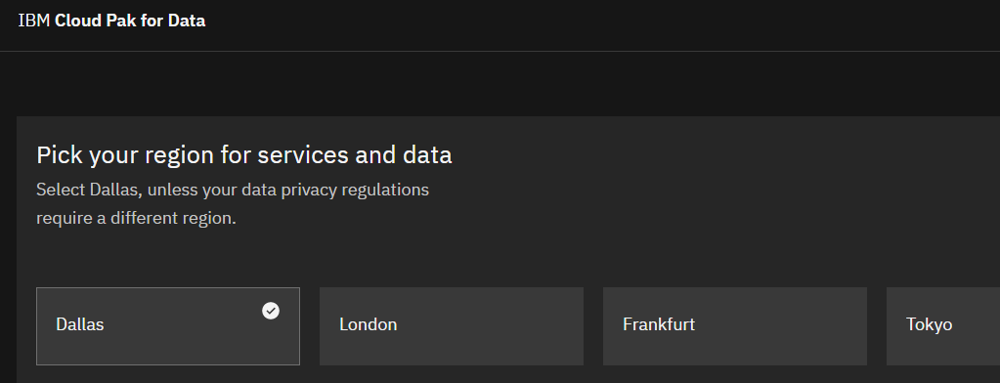
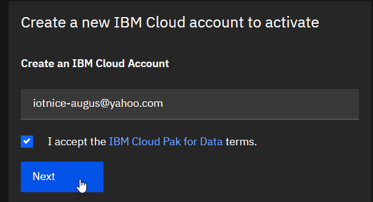
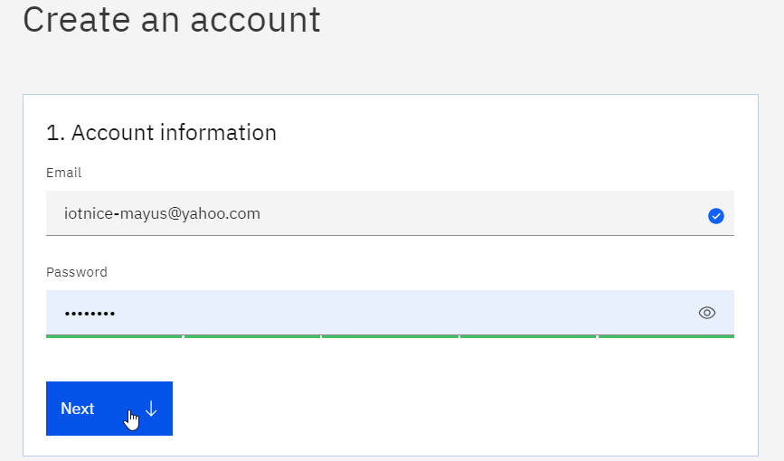
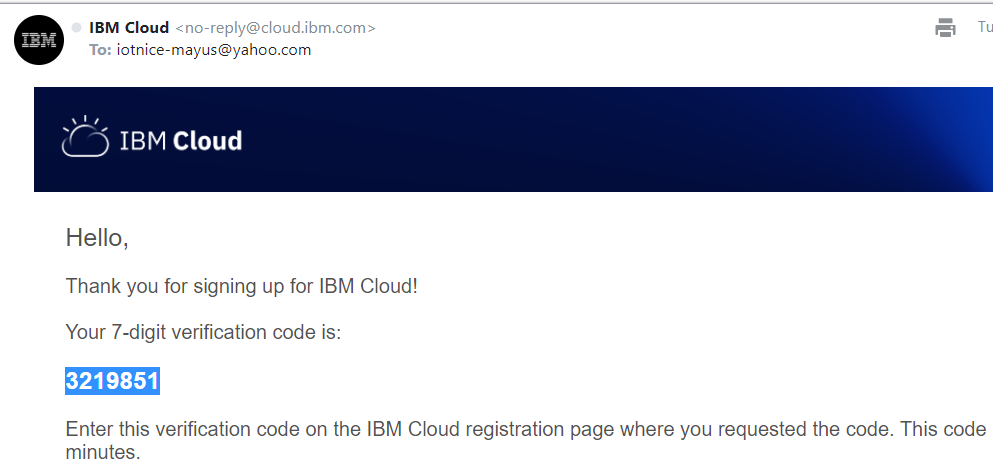
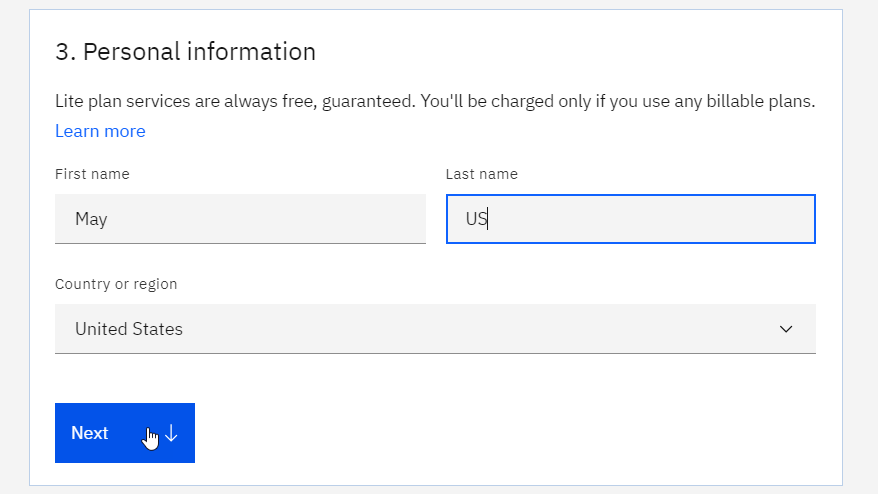
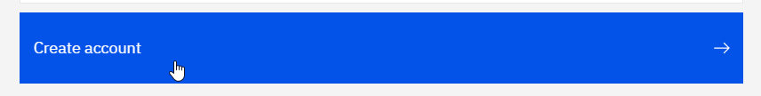
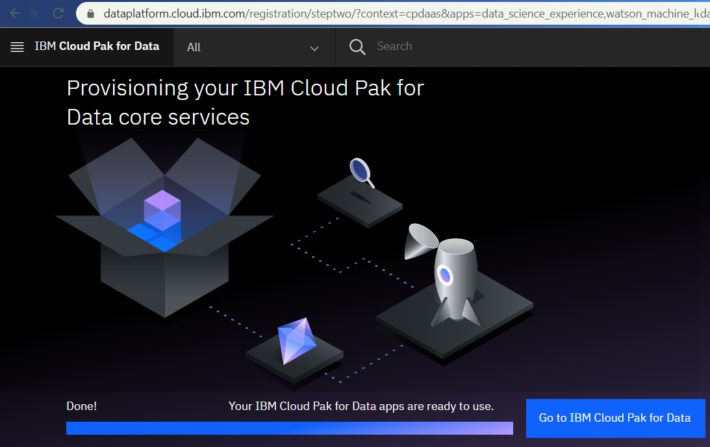
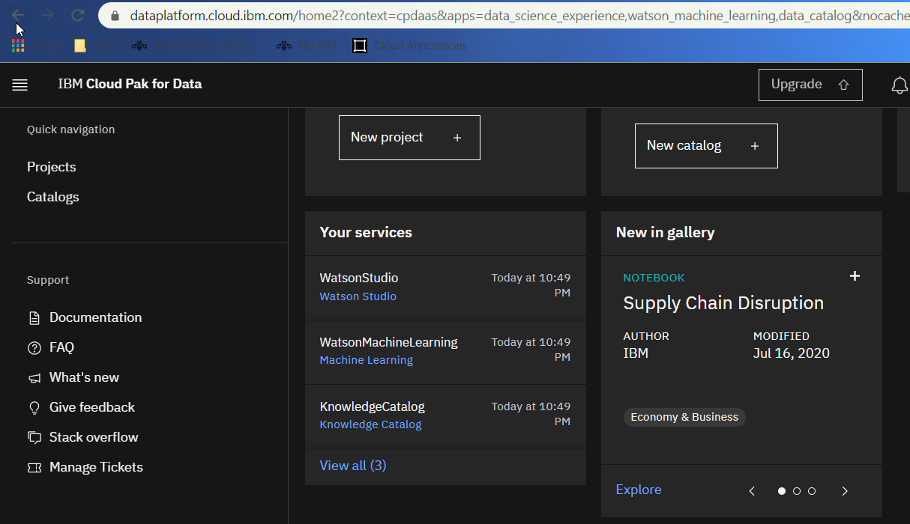
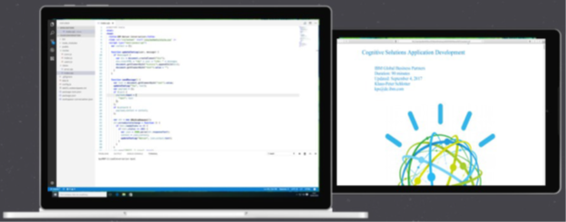

# Cloud Pak for Data as a Service
# Workshop Setup Instructions
#### *April 2021*

## Overview
The IBM Data&AI Workshops series include hands-on labs that will be performed by the participants on **IBM Cloud Pak for Data as as Service**, (formerly known as **Watson Studio** service) on the public version of **IBM Cloud**, using a web browser running on their own laptops, PC, Mac or true Linux.

The IBM Cloud Pak for Data as as Service environment leverages IBM Cloud infrastructure and accounts.   
To speed-up the Hands-On lab, it is advisable that participants setup their IBM Cloud environment prior to the workshop, following the instructions provided in this document.

In order to level-set the Labs environment, it is recommended that participant will run the Hands-On exercises using a new IBM Cloud free ’lite plan’ account.   
Participants already having an IBM Cloud account can still use it if they wish so, but there may be some discrepancies in the instructions.

Note that Watson Studio projects that will have been developed under a new free ’lite plan’ account can be shared with other existing account in the same region for further re-use.

### Steps outline
The instructions in this document will take you through the creation of an **IBM Cloud Pak for Data as a Service** Starter (Lite) instance, during which you will also setup and IBM Cloud Lite instance

**Note:** Instructions for the hands-on labs will be provided in `.pdf` format, if you have access to a tablet, please bring it along to display the instructions as it will be more practical than sharing space on the laptop's screen. 
See the last section of this document for reference to a screen sharing utility that can bring further ease of use.

## A. Create an IBM Cloud account

## IBM Cloud Pak for Data as as Service account
Note that we'll refer to **IBM Cloud Pak for Data as as Service** as **CP4DaaS** in the rest of this document.
1.	You will need to have an e-mail address (possibly an alias for a main e-mail address) available, if possible one which has never been used to setup an IBM Cloud (or Bluemix) account.
1. From a web browser, navigate to: https://dataplatform.cloud.ibm.com/registration/stepone
1. IBM CP4DaaS is available in 4 regional data centers. For the CP4DaaS workshops, we will assume you have setup for the **Dallas** (us-south) region: 
1. Enter the requested e-mail address to setup an associated IBM Cloud account and click `[Next]` : . If you already have an IBM Cloud account, you can skip this section.
1. Enter the requested e-mail address and password,then click `[Next v]` 
1. You may have to validate a captcha, then wait until you get registration confirmation e-mail 
1. Confirm registration by entering the verification code received in your e-mail, click on `[Next v]`
1. You are now prompted to enter your names and select a Country or region. 
  > **NOTE**: Most of the lab exercices assume that you have selected **_United States_** as Country or Region. Some beta or new features are available only in US data center. If you select another region/data center, you may need to adjust some of the lab instructions to accomodate for a different location for services and have to use URLs prefixed with `eu-gb` or `eu-de`

9. Clicking `[Next v]` and then `[Create account ->]`  leads you to the IBM Cloud account confirmation after acknowledging the privacy notice by clicking `[Proceed]`
1. You will be taken back to the CP4DaaS provisioning page:

1. Wait until the screen says *Done!* and click on the `[Go to Cloud pak for Data]` button
1. You will be taken to the Cloud Pak for Data as a Service landing page: 

1. Notice the *Watson Studio*, *Watson Machine Learning*, *Knowledge Catalog* services that have been provisioned for you in IBM Cloud.

> **Note**: To go back to the IBM Cloud landing page, you can navigate to <https://cloud.ibm.com/>

**Congratulations, your now have a new IBM Cloud environment all setup with CP4DaaS! You are now ready to run the workshop's Hands-On Labs.**

>**Note**: In the rest of the labs, if you created your CP4DaaS instance in the *`Dallas`* region, you will need to use the plain URLs without prefix, e.g. **`https://dataplatform.ibm.com`**, but if you created in the *`London`* region, you will need to use the `eu-gb` URLs, e.g. `https://eu-gb.dataplatform.ibm.com`, or `eu-de` for the *`Frankfurth`* region data center.

## Additional practical information

The Hands-On Labs will be run in part following instructions provided in PDF form, so having a tablet available can facilitate operations.

All Cut&Paste information can be accessed from a browser window on the PC/Mac.

You may want to use iDisplay (<https://getidisplay.com/>), where the tablet can even extend the Windows or Mac desktop: 
