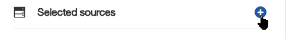
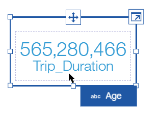
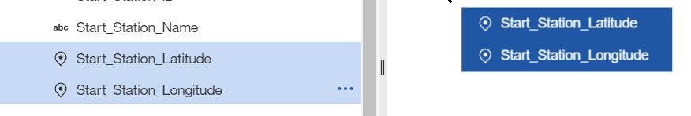
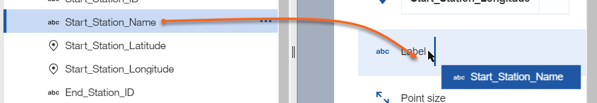
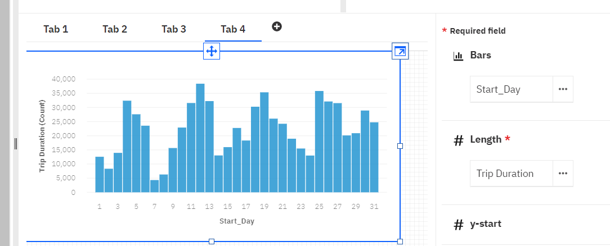

# Lab 1.2: Watson Studio Cognos Dashboard Embedded Visualizations
In this lab we will cover data visualization capability provided by **IBM Watson Studio**, the **IBM Watson Studio Dashboards** service, with a UI-driven capability to build and publish dashboards largely inspired by **IBM Cognos Analytics** capabilities.

## Watson Studio Cognos Dashboard Embedded
**IBM Watson Studio** has a built-in capability to build interactive, publishable dashboard.

## Setting up a dashboard
1. Back to your project's Assets list, select the `[(+) Add to project]` button 
1. Select the `Dashboard` button  to create a new dashboard
1. Enter a name, e.g. `NYC Bike Rentals`
1. We will need to create a dashboard service instance, select the `Associate a Cognos Dashboard Embedded service instance` link 
1. Select the `[New Service +]` button 
1. Select the **IBM Cognos Dashboard Embedded** tile 
1. Choose the 'Lite' plan 
1. Finally, associate the service with the project: , and switch back to the *New dashboard* creation tab.
1. Click the `Reload` link and select the instance, then the `Save` button: 
1. In the `Select a template`, use `Tabbed` and `Freeform`: , then `[OK]` button.

## Adding data to a dashboard
We will now use the data produced by Data Refinery for the NYC bike share dataset.
1. Switch to the `Select` tab and expand `Selected sources` 
1. Select the `201701-citibike-tripdata_cleansed.csv` file: 
1. The dashboarding has the ability to propose a graph type based on the data. We will start by displaying the `Trip Duration` by `Age`:
    1. Drag&Drop the `Trip_Duration` from the data panel on the left to the dashboard canvas on the right;  The `Trip_Duration` total aggregated sum is displayed as a large number: 
    1. Drop the `Age` field onto the `Trip_Duration` widget: 
    1. **IBM Watson Studio** changes the graph to a more suitable representation, in this case a line graph:
    1. You can switch the graph type to a histogram, by selecting the **Column** type of graph 
    1. The graph will change its rendering: 
    1. Unfortunately, our data has not been cleansed enough and we have erroneous values for `Age`. Select the **Fields** button .
    1. Right-click on the `Age` label to display the menu, and select the filter menu 
    1. In the filter definition box, select all values which do not make sense, i.e. values above 100: 
    1. then click the `Invert` button and OK. We get a better-looking graph where we can see the trip duration distribution by age .
1. Now add a new Freeform tab  where we will create a map display of the stations by count of rentals:
    1. Select the two `Start_Station_Latitude` and `Start_Station_Longitude` fields and drop them on the canvas: 
    1. The system automatically creates a map display, that you may want to resize: 
    1. Unfortunately, there is some parasitic data with erroneous coordinates that show up in the middle of the ocean at coordinate **(0,0)** below the African continent (This virtual place is known as `Null Island`). From the **Fields** tab, select the Latitude's Filter menu 
    1. In the filter definition, select the first `0` value, then `Invert` and OK button. The map will center itself on NYC: 
    1. We will now decorate the map view with additional information. Drop the `Start_Station_Name` onto the `Label`: 
    1. We see on the map an outlier to the south, we can filter it out by name, as we can get the `SSP Tech Workshop` label now by hovering over it 
    1. Click the Filter button for `Label`/*Start Station Name*, and enter a `Does not begin with` condition for `SSP Tech`: . The corresponding outlier points will disappear from the display.
    9. Add some coloring, by dropping the `Trip_Duration` field onto the `Point color`. The default aggregation is `SUM` which will show stations from where the cumulative trip are longer. This shows that a few stations are issuing longer rides than others, as they show in darker colors: 
    10. Change the aggregation used for the coloring, now based on the average trip duration. Select `Trip Duration`->`Summarize`->`Average`:.
    11. All points now look similar, except for a few outliers, which match specific stations 
    12. You can remove outlier manually by right-click selecting them on the map and selecting `exclude`: 
1. Correlated graphs selections (Widget connections)
    1. Drop the `End_Station_Latitude/Longitude` on the free space besides the `Start_Station` map to create a new map.
       Now, when clicking on a Station in the first map, the second map adjusts to show the corresponding `End_Station`: 
    1. Note that the selection groups can be adjusted using the `Widget connections` icon at the top 
1. Many other types of graphs can be built, as an exercise, build:
    1. a graph on another tab that will show the distribution of rentals by the hour of the day. You should end up with a **Column** graph such as . Note that the *Length* attribute, set to *Trip Duration*, should be summarized by *Count*.
    1. And last, build a graph that shows usage by day of month: . We see the weekly cycle, and probably the impact of weather conditions (There was a severe snowstorm in NY on Jan 7, 2017).
1. Finally, dashboards can be published:
    1. Click the `Share` icon: 
    2. Enable sharing: 
    3. Open the link from another tab or browser to get a web view on the dashboard
