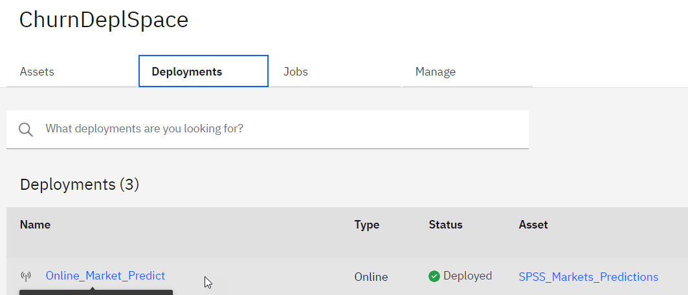

# Streaming Time Series with SPSS Flow Modeler Hands-on Lab
(C) IBM 2021 - Hybrid Cloud Build Team Europe

Author: philippe.gregoire@fr.ibm.com

# Introduction
## Lab objectives
This lab will show how to use SPSS Flow Modeler within CloudPak for Data on IBM Cloud to implement a timesseries prediction model.

The input dataset represents historical Market volumes over 60 months for a fictitious Broadband carrier on several markets. The goal of this Lab is to implement a prediction of the future market volumes.

## Reference Material:
* https://www.ibm.com/support/knowledgecenter/en/SS3RA7_sub/modeler_mainhelp_client_ddita/clementine/timeser_as_node_general.html

* https://www.ibm.com/support/knowledgecenter/en/SS3RA7_16.0.0/com.ibm.spss.modeler.help/clementine/streamingts_deploymenttab.htm#streamingts_deploymenttab

# Lab sequence instructions
## Add input file as asset
Upload `broadband.csv` as file Data Asset.

## Create SPSS Flow with Modeler
### Setup flow with asset as input
1. Create new Modeler Flow: 
1. Give it a name, e.g. *SPSS Streaming TS* 
3. Once the flow canvas is displayed, from the `Import` palette drawer, add a `Data Asset` node: 
4. Open the node from its menu: 
5. Set the Data Asset to the `broadband.csv` file 
6. From the `Outputs` palette, drop a `Data Audit` node and wire it to the Data Asset node: 
7. Run the flow using the `Play` icon: 
8. Switch to the View output tab on the right panel: 
9. Open the Data Audit 
10. We get a summary of the data in the set, basically `Market_1` to `Market_85` columns with 60 rows each, a `DATE_` field

### Creating a chart
1. A recent addition to SPSS Flow Modeler is the chart builder, implementing SPSS Visualization. You will recognize the graphical component also used in Data Asset exploration and Data Refinery.
1. From the *Graphs* palette drawer, select the *Charts* node and drop it on the canvas 
1. Wire the Data Asset and Charts nodes together 
1. Select the Charts node Open menu 
1. Launch the Chart Builder 
1. Select a chart type of Multi-series 
1. Select `DATE_` as the X-axis: 
1. Add several axis as Y-axis , select **line** type.
1. You can optionally select *Separate Y axes* to compare the slopes of the different markets within their own range 
1. You could similarly chose to Normalize the data 
1. We will now save the chart definition to the SPSS flow Graph node, click on add chart definition 
1. Click on the `[return to modeler button]`

Another way to get an understanding of the fields is to visualize them as a time plot:
1. From the `Graphs` drawer, select a `Time plot` node and wire it to the Data Asset node: 
1. Open the `Time Plot` node 
1. Select the `DATE_` as custom X axis, uncheck *separate panel* and *normalize*: 
1. Add all the `Market_*` columns:  except `Total`, `YEAR_`, `MONTH_` and `DATE_` (Select all from the upper check box, then unselect the unwanted ones)   

1. Now Run the graph node: 
1. Open the graph 
1. This gives an idea of how the markets behave, all are more or less increasing, with various amplitudes.  To visualize relative volatility, you may want to re-run the graph node with `Normalize` checked.

### Process data to prepare for prediction
We will want to work on a subset of the markets rather than the 89 ones, and use the `DATE_` column as the time indicator.
1. For the purpose of the lab, we will subselect only the 5 first markets. From `Field Operations` palette drawer drop a `Filter` node and wire it to the Data Asset: 
1. Open the filter node from its menu, select to retain fields, and keep only `Market_1` to `Market_5` and `DATE_`: 
1. In order to convert the `DATE_` string to a date-typed field, we will add a `Filler` node and wire it after the `Filter` node. Setup the `DATE_` column to fill-in, with condition `Always` 
1. Set the `Replace with` formula to `to_date('DATE_')`  and then `[Save]`
1. We will need to specify which fields are to be used as input or output to the prediction node. Add a *Type* node and wire it after the *Filler* node: 

## Build the Streaming TimeSeries
1. Setup the *Type* node so that the `Market_*` fields have a role of `Both`, while the `DATE_` field has a role of `Input`: 
1. From `Record Operations` add a `Streaming TS`  node and wire it after the *Type* node.
1. Setup the *Streaming TS* node, add the `Market_*` fields both as *Targets* and *Candidate Input*: 
1. In *OBSERVATIONS AND TIME INTERVAL*, setup `DATE_` as Date/Time field, `Months` for time interval, `1` for the increment
1. In *Build Options - General*, setup *Expert Modeler*, for all models, un-select  *Seasonal* and select *Sophisticated Exponential Smoothing* methods: 
1. In *Model Options*, setup forecast to `5` records in the future, and select confidence and residuals computation: 
1. Run the *Streaming* node once using its `Run` menu item, in order to materialize the prediction columns. 
1. We will get additional columns for the predictions:
   * `$TS-Market_1`: the sliding window prediction
   * `$TSLCI-Market_1` and `$TSUCI-Market_1`: the Lower and Upper Confidence Indicators for the prediction.
     * `$TSResidual-Market_1`: the computed residuals of prediction vs actuals
1. Add a *Time Plot* node from the `Graphs` drawer and wire it after the *Streaming* node. 
1. Configure the node to be named `Predictions`, using all attributes: 
1. Now run the *Time plot* node, this constructs the graph with predictions, which can be found in the *View outputs* panel: 
1. Finally, from the view panel, select the eye button to display the predictions graph: 
1. Stretch Lab extension: You can work with the Graphs/Charts enhanced visualization node to explore and generate additional displays.

## Deploy Streaming TimeSeries model
1. In order to get the output of the deployment, add a `Table` node from the *Outputs* drawer, and wire it to the *Streaming TS* node: 
1. From the *Table* node menu, select `Save branch as model`: 
1. In the *Save Model* panel, make sure the `Table` branch is selected as terminal node, give it a name, e.g. `SPSS_Markets_Predictions` and save: 
1. We will now deploy the model as a REST API endpoint. Switch back to your project, locate you newly saved model in the *Models* section and select *Promote* from its menu: 
1. In the next *Promote to space* panel, select a target space (we can use the one created earlier, `ChurnDeplSpace`, or create a new one)
1. Once promoted to the space, we can add a deployment, switch to the deployment space 
1. Click the *Deploy* button 
1. Select *Online* type, give it a name, e.g. `Online_Market_Predict`, and `[Create]` 
1. From the Deployment tab , you can navigate to the REST service definition, especially the implementation tab will show among other languages the Python client code to invoke prediction.

## Invoke the REST endpoint from a notebook
We could test the deployed service from the Cloud UI interface, but the volume of input data does not make it very practical.   
So, we will use a Python Jupyter notebook to test and display predictions.

1. The test notebook has been prepared for you. It is derived from the Python implementation sample code, but is using the WML Python wrapper library to find the model named `Online_Market_Predict`.
1. Switch back to your project and add an asset of type *Notebook*: 
1. Switch to the *From file* tab, and choose  `WML_StreamingTS_Predictions.ipynb` notebook, select the 'Default Python 3.5 Free' environment: 
1. Follow the notebook execution flow, which will call the predictions WML endpoint and chart the results.
