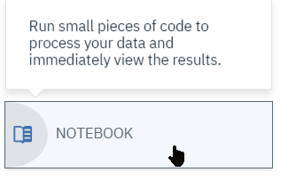
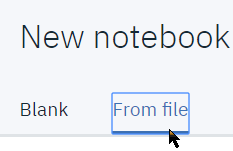
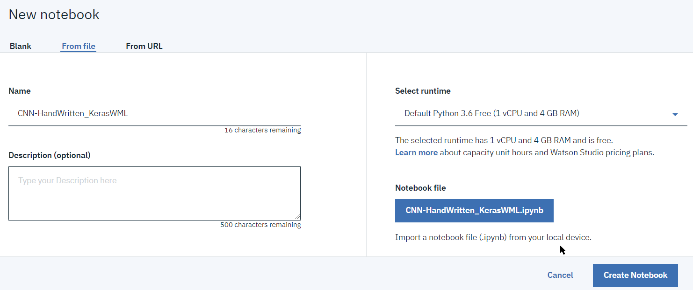
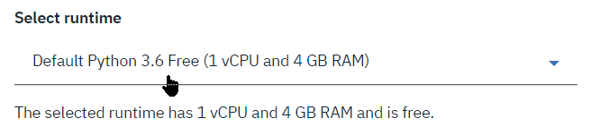
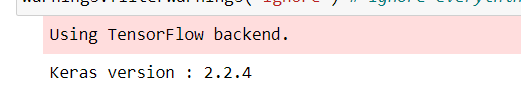
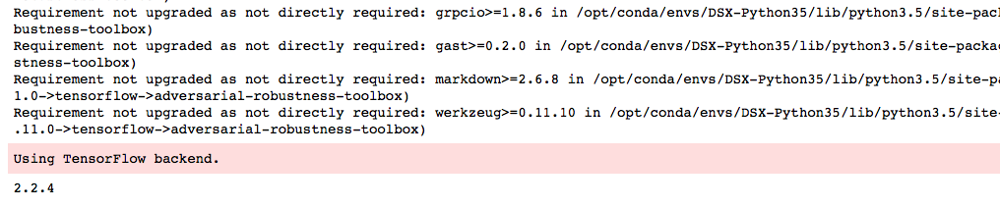
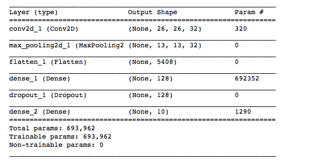
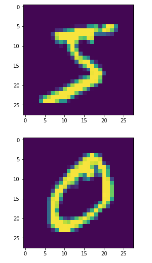
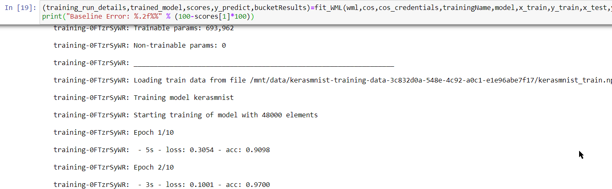
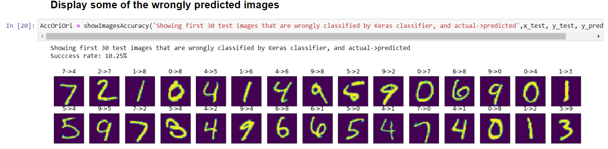

# IBM Watson Studio on Cloud Deep Learning Hands-on Lab

### MNIST Handwritten digit recognition with Keras trained on Watson Machine Learning GPUs


## Introduction
This tutorial shows how to use an IBM Watson Studio using Jupyter notebook to train a *Convolutional Neural Network* (CNN) Keras model using *Watson Machine Learning* (WML)

The model is built using standard Keras/TensorFlow framework within an IBM Watson Studio Jupyter notebook, and then trained on WML with GPU.

The dataset used for this exercise is the classical MNIST HandWritten digits.

# Overview
Watson Studio provides you with the environment and tools to solve your business problems by collaboratively working with data. You can choose the tools you need to analyze and visualize data, to cleanse and shape data, to ingest streaming data, or to create, train, and deploy machine learning models.

This diagram shows how the architecture of Watson Studio is centered around the project. A project is where you organize your resources and work with data.


# Lab instructions
The following instructions will guide you through setting up the Watson Studio project and run the prebuilt notebook which has been prepared for you.

##  Step 1 - Create your notebook
We will import a pre-written notebook into Watson Studio
1. Once logged in the Watson Studio platform, open your project and create a new Notebook from the top menu: 

1. Select the 'From File' tab 
1. and the `CNN-HandWritten_KerasWML.ipynb` file 
1. Select an environment. Since computation will be delegated to WML, you can select a small environment, for example the `Default Python 3.6 Free`:  

You're now ready to start exercising your Handwritten digit Keras CNN and test it.

## Step 2 - Follow notebook instructions
Now switch to your notebook and execute the code within, by selecting the `Run` option for reach cell.
Make sure you inspect the existing code and read the comments to get an idea for the way it works, and interpret the results.

### Notes about the code
1. The first code cells initialize Keras with TensorFlow, you should get something like :

1. The next code cell defines some boilerplate functions to deal with data loading and image display, define some utility functions to display the digits.

2. We then use utility functions to load the **MNIST** annotated dataset.
``` python
# Read MNIST dataset
(x_train, y_train), (x_test, y_test), min_, max_ = load_dataset(str('mnist'))
```
3. Then come the cells which are the core of the model structure buildup
``` python
# Create Keras convolutional neural network - basic architecture from Keras examples

k.set_learning_phase(1)
model = Sequential()
model.add(Conv2D(32, kernel_size=(3,3), activation='relu', input_shape=x_train.shape[1:]))
model.add(MaxPool2D(pool_size=(2,2)))
model.add(Flatten())
model.add(Dense(128, activation='relu'))
model.add(Dropout(0.25))
model.add(Dense(10, activation='softmax'))

model.compile(loss='categorical_crossentropy', optimizer='adam', metrics=['accuracy'])

# Set Hyperparameters
Optimizer = RMSprop(lr=0.001, rho=0.9, epsilon=1e-08, decay=0.0)
# Initialize and compile:
model.compile(optimizer=Optimizer, loss='categorical_crossentropy', metrics=['accuracy'])
model.summary()
```
You get a summary of our ANN model as shown hereafter
Note the total number of weights & bias to be determine during the training sequence and understand how complex can be to train very complex ANN with hundreds of layers (here we have only 3 !).

4. The utility function is used to display images from the training set
``` python
Show_Images(x_train,2)
```


5. The model defined above is then trained in Watson Machine Leraning with GPUs using the boilerplate wrapper code for the `fit()` method.
``` python
# Train the model on WML with GPUs
(training_run_details,trained_model,scores,y_predict,bucketResults)=fit_WML(wml,cos,cos_credentials,trainingName,model,x_train,y_train,x_test,y_test)
print("Baseline Error: %.2f%%" % (100-scores[1]*100))
```
In the cell that runs `fit_WML()`, you will see the log from the remote training occuring in Watson Machine Learning.    
You will see the successive training epoch iterations been executed, with an accuracy & loss values associated to the model.


6. The training and verification code has checked actual accuracy and extracted which digits not recognized by our generated model:
You get a display of a small selection of the mismatched digits, which will vary depending on the implemented model :

