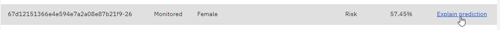

# Watson OpenScale Labinar

### Prerequisistes
For this lab, we suppose that you have an instance of ***IBM Cloud Pak for Data*** SaaS setup on IBM Cloud.
This should consist in an IBMCloud account provisioned with Lite plan instances of *Watson Studio*, *Cloud Object Storage*, *Watson Machine Learning* services in the *Dallas* region.

To verify this, navigate to https://dataplatform.cloud.ibm.com/data/services?target=services&context=cpdaas and verify that you have a setup similar to this one: 

## Lab A-OpenScale setup and tour
In this first initialization lab, we will follow the *Watson Open Scale* automated setup procedure.

### A-1 Provision and setup a Watson OpenScale Lite plan.
* Log in to your IBM Cloud Pak for Data account at https://dataplatform.cloud.ibm.com
The automated procedure will setup *IBM Cloud Pak for Data* on IBMCloud

#### Create a *Deployment Space* for use by *Watson OpenScale*
1. From the "hamburger" menu, locate the *Deployment spaces* menu and select *View all spaces* 
1. Click the `[New deployment space +]` button 
1. Select *Create an empty space* 
1. Give the space a name, e.g. `WOS Depl Space`, make sure you have selected your instance of *Cloud Object Storage* and *Watson Machine Learning*, then click `[Create]` 
1. You may review the space details, which are not much at this stage

#### Create a *Watson OpenScale* service instance
1. Back to the *Service instances* page, select the `[Add service]` button 
1. Chose the *Watson OpenScale* tile 
1. Select the **Lite** plan in the **Dallas** region 
1. Keep default name and click 

#### Setup the *Watson OpenScale* service
1. Select your the *Watson OpenScale* hyperlink 
1. This opens the OpenScale *Manage* tab in a separate tab. Click `[Launch Application]` button 
1. At the application startup you're proposed to initiate the setup wizard, please do so by clicking on the *Auto setup* button 
1. You can see the dashboard being populated in the background while the *German Credit Risk* model gets created. It configures the database used to store the DataMart, associates a Machine Learning provider, deployment space and assigns the user and roles.
1. The setup process will take a while, it is a good time to make a coffee or tea break,
1. Finally, click on the `[Let's go]` button 
*Watson OpenScale* is now configured!
> Note: the Auto setup actions can also be performed manually if you'd have to instrument your own model. See an example of programmatic  set up at https://cloud.ibm.com/docs/ai-openscale?topic=ai-openscale-tutorial-crt-ov
> This setup implements a first use case of AI bias detection, mitigation and explainability usecase.
The setup will retrieves a Credit Risk dataset, builds the model to determine if the credit should be approved or rejected for a given person.
Once done the setup will deploy the created model on the **Watson Machine Learning** runtime framework and therefore will generate user requests to simulate a few days of historical payloads. Then OpenScale will use it to assess the model in term of explainability and bias.

### A-2 - Tour of Watson OpenScale
After setup, OpenScale proposes a quick tour, follow-up on the Navigation tutorial, which will take you through the various functions or Watson OpenSCale.

### A-* Optional: Explore Watson OpenScale dashboard elements
The instructions below show how to navigate the OpenScale dashboard on your own:
1. Return back to the Watson OpenScale dashboard (https://aiopenscale.cloud.ibm.com/aiopenscale/insights). You should now have a card for the **GermanCreditRiskModel**.
1. After this setup completes, you should get a screen similar to this: 
1. Click on the card's View details menu 
1. The dashboard will show the status of the characteristics under monitoring.
1. Let's look into **Fairness**
    1. It has not been setup with major deviations in this example. Click on the fairness score (95%) to get a more detailed report.
    1. On the right of the diagram, locate the records that have been evaluated  and click
    1. You can see the fairness score calculated for the Monitored group vs Reference group. It shows a slight unfairness which is still within the acceptable fairness range (above the threshold of 80%), so no alert has been raised.
    1. Clicking on `[View payload transactions]` lists all the transactions. Locate one of the transactions for `Female` which has a `Risk` outcome  and click on `Explain prediction`
    1. The transaction explanability shows that the `LoanDuration` attribute is the highest influencing one 
    1. Select the `Inspect` tab 
    1. Change the value of `LoanDuration` to `25`, and `Sex` to `male`, then click on `[Score new values]` 
    1. You can see that the outcome is still `Risk`, albeit with a lower confidence. Now select a value of 24, you will see that the risk switches to `No Risk.`
    1. You can have OpenScale run this analysis automatically 
    1. The values may come out different because the *Confidence* index is higher 
    1. Going back to the model through the breadcrumbs 
1. Now let's see the **Drift**
    1. Click on the drift **3%** value 
    1. We can see that the two factors `Drop in accuracy` and `Drop in consistency` have been computed  Select the click to view Details
    1. We now have a summary of transactions that contribute to those two factors. 3 transactions contribute to both , click on the link.
    1. Finally, click on the first tile 
    1. Clicking on `More...`  shows that the reason detected by the system is that *The values of the ExistingSavings and EmploymentDuration features rarely occur together.*
